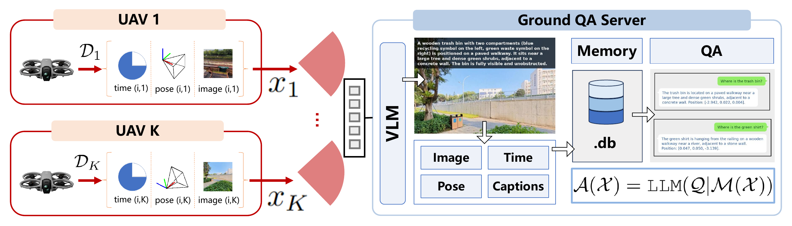
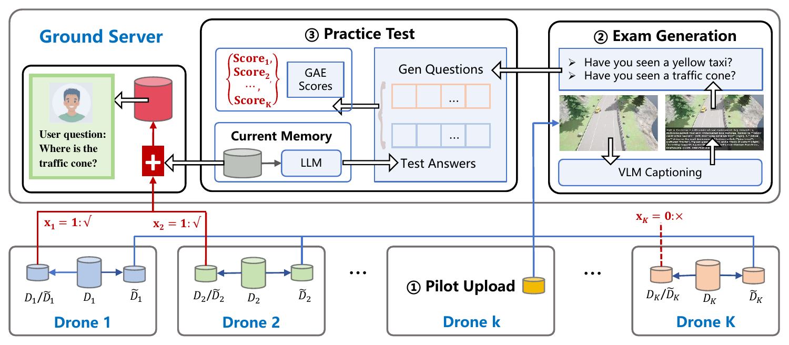
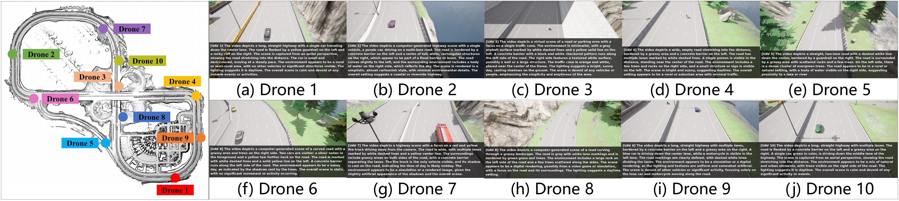
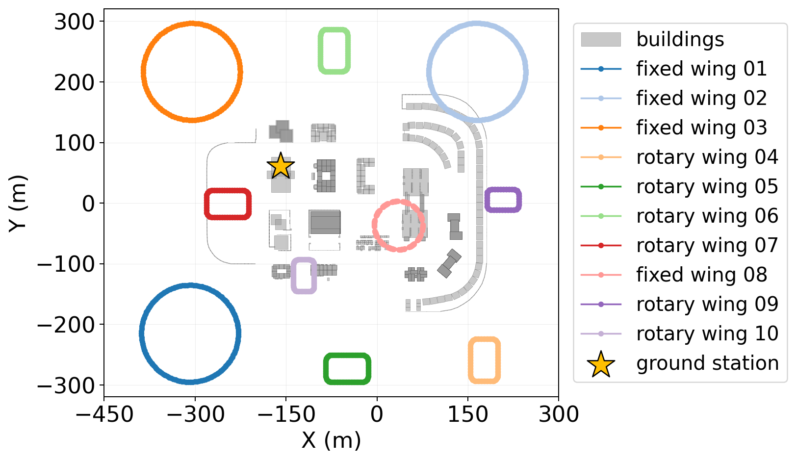
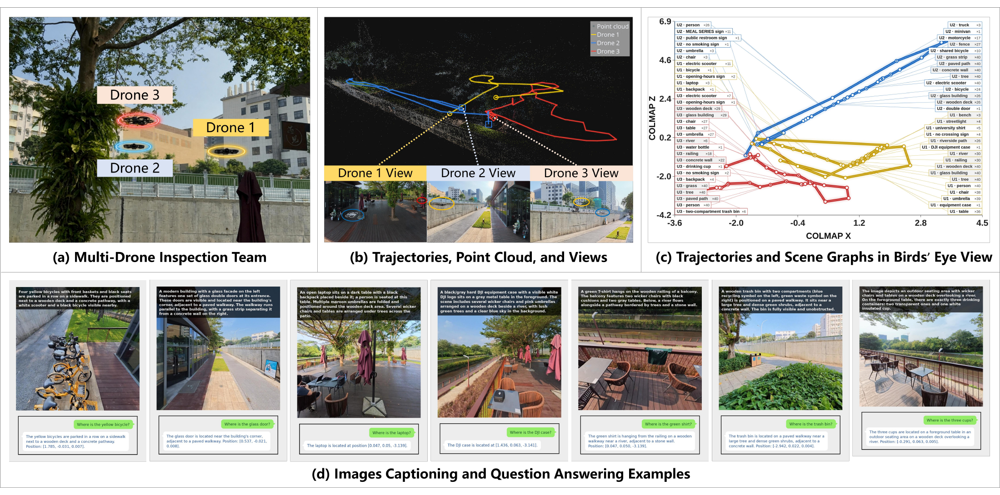
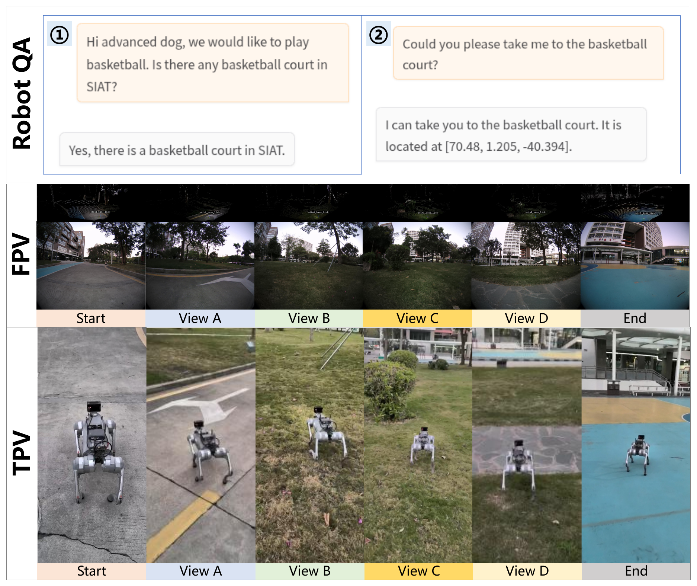

<div align="center">

# OpenMAMS： Open-Sourced Multi-Agent Memory System

### Memory in the Sky: Low-Altitude Question Answering with Multi-Agent Memory Aggregation

Chengyang Li<sup>1</sup>, Yujie Wan<sup>2</sup>, Shuai Wang<sup>3</sup>, Kejiang Ye<sup>3</sup>, Weijie Yuan<sup>2</sup>, Boyu Zhou<sup>2</sup>, Yik-Chung Wu<sup>1</sup>, Chengzhong Xu<sup>4</sup>, and Huseyin Arslan<sup>5</sup>

<sup>1</sup>The University of Hong Kong · <sup>2</sup>Southern University of Science and Technology<br>
<sup>3</sup>Shenzhen Institutes of Advanced Technology, Chinese Academy of Sciences<br>
<sup>4</sup>University of Macau · <sup>5</sup>Istanbul Medipol University

[Overview](#overview) · [Architecture](#architecture) · [CARLA Simulation](#carla-simulation) · [Real-World Experiments](#real-world-experiments) · [Citation](#citation)

**Code coming soon** · arXiv link to be added

</div>

> OpenMAMS aggregates distributed UAV memories for long-horizon question answering. Our memory-centric framework measures what each candidate memory adds, then jointly selects UAVs and allocates transmit power under communication constraints.

## Overview

OpenMAMS is the multi-agent memory system and benchmarking platform developed for **low-altitude question answering (LAQA)**. It connects aerial observations with a ground memory server so that users can ask about objects, locations, and events observed over time.

The platform described in the paper supports:

- **Multi-agent data collection:** images, timestamps, 6D poses, and LiDAR point clouds in CARLA.
- **Memory construction and retrieval:** VLM captioning, text embeddings, and a vector database for spatiotemporal queries.
- **Memory quality evaluation:** a generative adversarial exam (GAE) measures the knowledge gap between candidate observations and the current memory.
- **Memory-centric resource allocation:** MemCen jointly selects UAV memories and allocates transmit power, with penalty successive optimization (PSO) and learning to memorize (L2M) solvers.

## Architecture



Selected observations are captioned and stored with their timestamps and poses. The resulting global memory supports retrieval-augmented question answering.

<details>
<summary><strong>How does GAE evaluate a candidate memory?</strong></summary>



GAE generates questions grounded in candidate observations and tests whether the current global memory can answer them. Unanswered questions reveal missing knowledge and quantify the value of acquiring that candidate memory. MemCen combines this task utility with payload sizes, channel conditions, interference, and power constraints.

</details>

## CARLA Simulation

### Town04: multi-UAV inspection



UAVs inspect different regions of Town04 and collect observations for memory construction. The illustrated five-UAV setup evaluates the value of complementary memories. Questions ask whether an object is present, where it is located, and which UAV observed it.

### Town05: dynamic and heterogeneous UAVs



Four fixed-wing and six multirotor UAVs conduct a 200-second search-and-rescue mission in Town05. Their trajectories, image workloads, and building blockage create varying communication conditions. MemCen selects complementary memories and adapts transmit power to support downstream question answering.

## Real-World Experiments

### Panoramic multi-agent system (PMAS)



Three panoramic UAVs collect complementary observations along distinct routes. Their observations are registered in a shared 3D coordinate frame for object-presence and spatial-grounding questions. The aerial data are collected in the field, while communication is evaluated through offline channel replay.

### UAV-to-ground-robot memory reuse



A robot dog reuses aerial memory to answer environmental questions and navigate to a queried location.

## Selected Results

| Evaluation | Setting | MemCen QA accuracy |
| --- | --- | ---: |
| CARLA Town04 | Static communication conditions | **92.4%** |
| CARLA Town05 | Dynamic channels, heterogeneous UAVs, and building blockage | **84.0%** |
| PMAS | Real aerial observations with offline channel replay | **88.5%** |

## Code

The source code will be released in this repository. This initial version contains the paper overview and figures. Implementation and usage instructions will be added with the code release.

## Citation

If you find this work useful, please cite:

```bibtex
@misc{li2026memoryinthesky,
  title  = {Memory in the Sky: Low-Altitude Question Answering with Multi-Agent Memory Aggregation},
  author = {Li, Chengyang and Wan, Yujie and Wang, Shuai and Ye, Kejiang and Yuan, Weijie and Zhou, Boyu and Wu, Yik-Chung and Xu, Chengzhong and Arslan, Huseyin},
  year   = {2026},
  note   = {Preprint}
}
```

The arXiv identifier and paper link will be added when available.

## Contact

- **Chengyang Li**: [KevinLADLee](https://github.com/KevinLADLee)
- **Shuai Wang**: [bearswang](https://github.com/bearswang)
